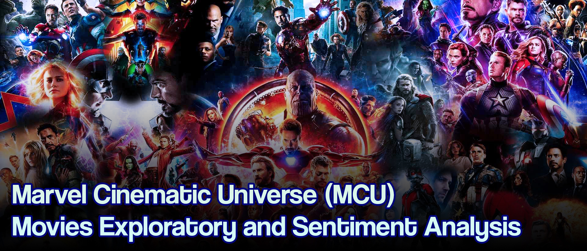
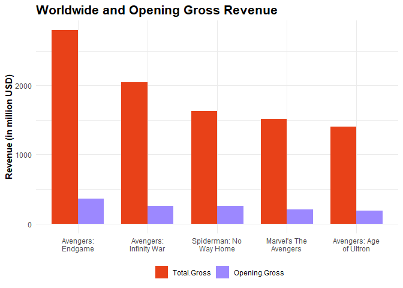
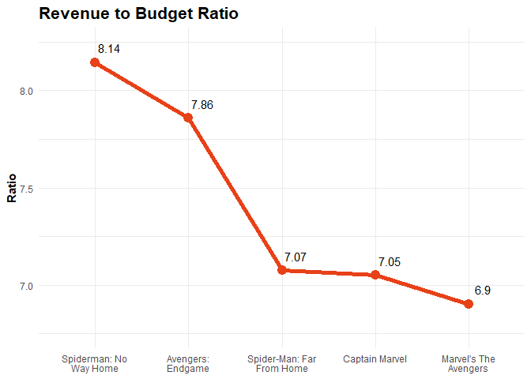
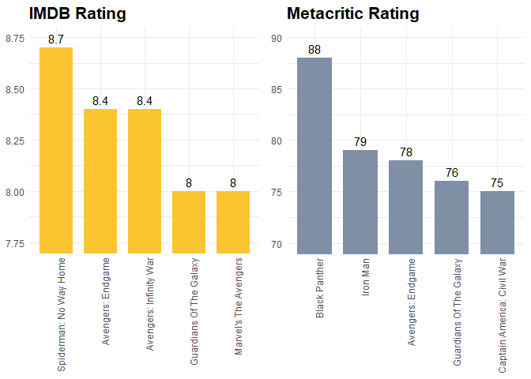
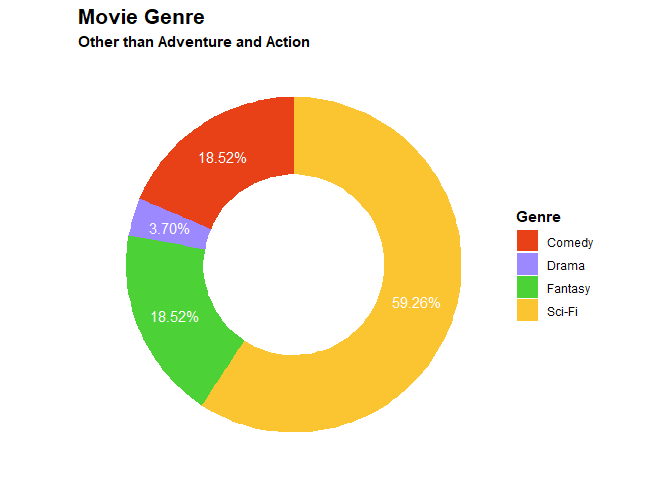
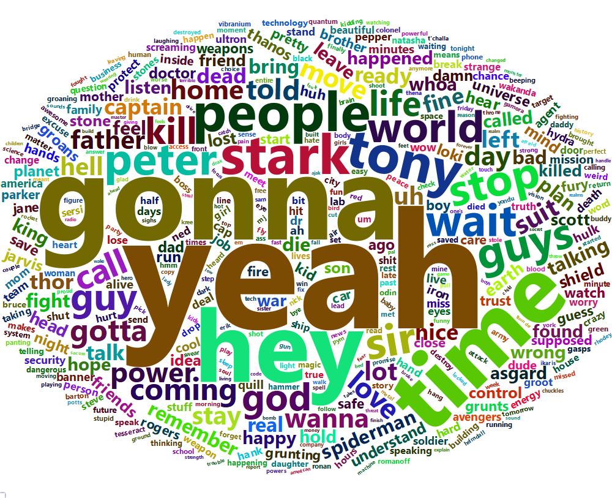
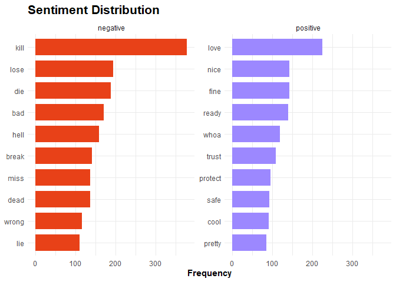
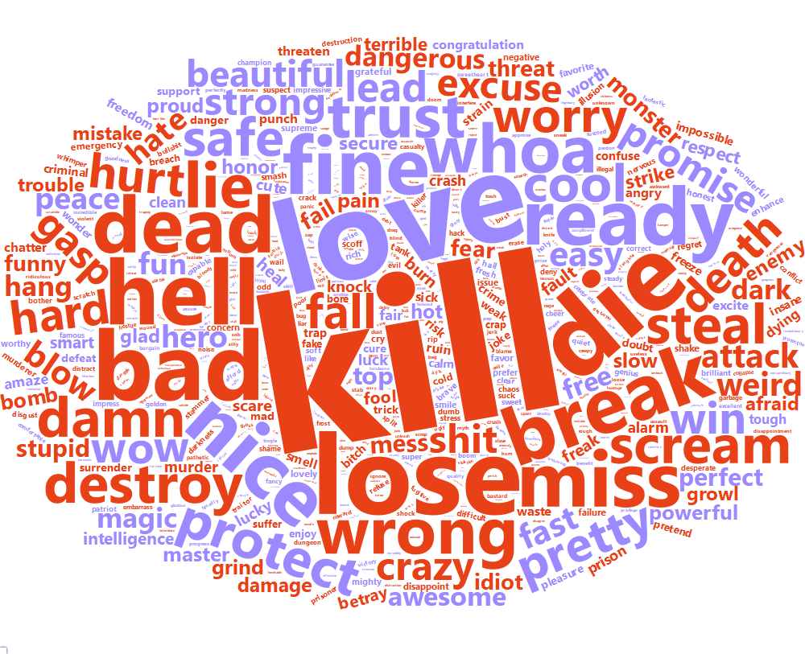

# I Love You 3000 - Marvel Cinematic Universe (MCU) Movies Exploratory and Sentiment Analysis


*Illustration asset by [Kincir](https://kincir.com/movie/cinema/cara-marvel-cinematic-universe-memperpanjang-cerita-y0VwgYEOSdket)*

## Introduction

“I love you 3000,” said Morgan Stark to her dad—Tony Stark aka Iron Man.
Iron Man is one of the former member of the Avengers, he’s my favorite
Avengers all the time. The Avengers is a fictional superhero team based
on Marvel Comics. It is the part of the Marvel Cinematic Universe (MCU)—a
superhero movie franchise produced by Marvel Studios. There are 27
movies until late 2021, their recent movie is Spider-Man: No Way Home
which was released in December 2021. As a fan, I’m interested to learn
more about their movies through exploratory data analysis and simple
sentiment analysis.

## Data preparation

I used three different data from Kaggle and Wikipedia.

1.  MCU complete dataset by Rachit239
    (<https://www.kaggle.com/rachit239/mcu-complete-dataset>)
2.  Marvel Cinematic Universe Dialogue Dataset by Pranav Hari
    (<https://www.kaggle.com/phiitm/marvel-cinematic-universe-dialogue-dataset>)
3.  Characters of the Marvel Cinematic Universe
    (<https://en.wikipedia.org/wiki/Characters_of_the_Marvel_Cinematic_Universe>)

I downloaded the data from Kaggle on Nov 19th, 2021, but then I manually
updated it by myself on Jan 20th, 2022.

### Loading packages and defining color palette

``` r
#data manipulation
library(tidyverse)
library(lubridate)
library(tidytext)
library(stopwords)
library(textdata)
library(textstem)

#data visualization
library(wordcloud2)
library(webshot)
library(htmlwidgets)
library(gridExtra)

#color palette
colorParam <- c("#e84118", "#9c88ff", "#4cd137", "#fbc531", "#7f8fa6")
```

### Importing data (1)

Having the data imported, I processed the data by
reformatting dates with `lubridate` and parsing numeric values with
`stringr` from `tidyverse`.

``` r
mcu <- read.csv("mcu dataset.csv", sep = ";") %>% 
  tibble()
mcu <- mcu %>%
  mutate(
    US.release.Date = mdy(US.release.Date),
    Budget = parse_number(Budget),
    Domestic.Gross = parse_number(Domestic.Gross),
    Total.Gross = parse_number(Total.Gross),
    Opening.Gross = parse_number(Opening.Gross)
  )
head(mcu) %>% 
  kable()
```

<table>
<thead>
<tr>
<th style="text-align:left;">
Name
</th>
<th style="text-align:left;">
US.release.Date
</th>
<th style="text-align:left;">
Director
</th>
<th style="text-align:left;">
Producer
</th>
<th style="text-align:left;">
Duration
</th>
<th style="text-align:left;">
Genre
</th>
<th style="text-align:right;">
IMDB.rating
</th>
<th style="text-align:right;">
metascore
</th>
<th style="text-align:left;">
Cast
</th>
<th style="text-align:right;">
Budget
</th>
<th style="text-align:right;">
Domestic.Gross
</th>
<th style="text-align:right;">
Total.Gross
</th>
<th style="text-align:right;">
Opening.Gross
</th>
<th style="text-align:right;">
Oscar.Nomination
</th>
<th style="text-align:right;">
Oscar.won
</th>
<th style="text-align:right;">
Phase
</th>
</tr>
</thead>
<tbody>
<tr>
<td style="text-align:left;">
Iron Man
</td>
<td style="text-align:left;">
2008-05-02
</td>
<td style="text-align:left;">
Jon Favreau
</td>
<td style="text-align:left;">
Avi Arad and Kevin Feige
</td>
<td style="text-align:left;">
2h 6min
</td>
<td style="text-align:left;">
Action, Adventure, Sci-Fi
</td>
<td style="text-align:right;">
7.9
</td>
<td style="text-align:right;">
79
</td>
<td style="text-align:left;">
Robert Downey Jr., Gweneth Paltrow, Terrence Howard
</td>
<td style="text-align:right;">
1.4e+08
</td>
<td style="text-align:right;">
318604126
</td>
<td style="text-align:right;">
585366247
</td>
<td style="text-align:right;">
98618668
</td>
<td style="text-align:right;">
2
</td>
<td style="text-align:right;">
0
</td>
<td style="text-align:right;">
1
</td>
</tr>
<tr>
<td style="text-align:left;">
The Incredible Hulk
</td>
<td style="text-align:left;">
2008-06-13
</td>
<td style="text-align:left;">
Louis Leterrier
</td>
<td style="text-align:left;">
Avi Arad, Gale Ann Hurd and Kevin Feige
</td>
<td style="text-align:left;">
1h 52min
</td>
<td style="text-align:left;">
Action, Adventure, Sci-Fi
</td>
<td style="text-align:right;">
6.6
</td>
<td style="text-align:right;">
61
</td>
<td style="text-align:left;">
Edward Norton, Liv Tyler, Tim Roth
</td>
<td style="text-align:right;">
1.5e+08
</td>
<td style="text-align:right;">
134806913
</td>
<td style="text-align:right;">
264770996
</td>
<td style="text-align:right;">
55414050
</td>
<td style="text-align:right;">
0
</td>
<td style="text-align:right;">
0
</td>
<td style="text-align:right;">
1
</td>
</tr>
<tr>
<td style="text-align:left;">
Iron Man 2
</td>
<td style="text-align:left;">
2010-05-07
</td>
<td style="text-align:left;">
Jon Favreau
</td>
<td style="text-align:left;">
Kevin Feige
</td>
<td style="text-align:left;">
2h 4min
</td>
<td style="text-align:left;">
Action, Adventure, Sci-Fi
</td>
<td style="text-align:right;">
7.0
</td>
<td style="text-align:right;">
57
</td>
<td style="text-align:left;">
Robert Downey Jr., Gweneth Paltrow, Mickey Rourke
</td>
<td style="text-align:right;">
2.0e+08
</td>
<td style="text-align:right;">
312433331
</td>
<td style="text-align:right;">
623933331
</td>
<td style="text-align:right;">
128122480
</td>
<td style="text-align:right;">
1
</td>
<td style="text-align:right;">
0
</td>
<td style="text-align:right;">
1
</td>
</tr>
<tr>
<td style="text-align:left;">
Thor
</td>
<td style="text-align:left;">
2011-05-06
</td>
<td style="text-align:left;">
Kenneth Branagh
</td>
<td style="text-align:left;">
Kevin Feige
</td>
<td style="text-align:left;">
1h 55min
</td>
<td style="text-align:left;">
Action, Adventure, Fantasy
</td>
<td style="text-align:right;">
7.0
</td>
<td style="text-align:right;">
57
</td>
<td style="text-align:left;">
Chris Hemsworth, Anthony Hopkins, Natalie Portman
</td>
<td style="text-align:right;">
1.5e+08
</td>
<td style="text-align:right;">
181030624
</td>
<td style="text-align:right;">
449326618
</td>
<td style="text-align:right;">
65723338
</td>
<td style="text-align:right;">
0
</td>
<td style="text-align:right;">
0
</td>
<td style="text-align:right;">
1
</td>
</tr>
<tr>
<td style="text-align:left;">
Captain America: The First Avenger
</td>
<td style="text-align:left;">
2011-07-22
</td>
<td style="text-align:left;">
Joe Jhonston
</td>
<td style="text-align:left;">
Kevin Feige
</td>
<td style="text-align:left;">
2h 4min
</td>
<td style="text-align:left;">
Action, Adventure, Sci-Fi
</td>
<td style="text-align:right;">
6.9
</td>
<td style="text-align:right;">
66
</td>
<td style="text-align:left;">
Chris Evans, Hugo Weaving, Samuel L. Jackson
</td>
<td style="text-align:right;">
1.4e+08
</td>
<td style="text-align:right;">
176654505
</td>
<td style="text-align:right;">
370569774
</td>
<td style="text-align:right;">
65058524
</td>
<td style="text-align:right;">
0
</td>
<td style="text-align:right;">
0
</td>
<td style="text-align:right;">
1
</td>
</tr>
<tr>
<td style="text-align:left;">
Marvel’s The Avengers
</td>
<td style="text-align:left;">
2012-05-04
</td>
<td style="text-align:left;">
Joss Whedon
</td>
<td style="text-align:left;">
Kevin Feige
</td>
<td style="text-align:left;">
2h 23min
</td>
<td style="text-align:left;">
Action, Adventure, Sci-Fi
</td>
<td style="text-align:right;">
8.0
</td>
<td style="text-align:right;">
69
</td>
<td style="text-align:left;">
Robert Downey Jr., Chris Evans, Scarlett Johansson, Jeremy Renner
</td>
<td style="text-align:right;">
2.2e+08
</td>
<td style="text-align:right;">
623357910
</td>
<td style="text-align:right;">
1518812988
</td>
<td style="text-align:right;">
207438708
</td>
<td style="text-align:right;">
1
</td>
<td style="text-align:right;">
0
</td>
<td style="text-align:right;">
1
</td>
</tr>
</tbody>
</table>

## Exploratory data analysis

### Top-selling movies

Let’s see the top-selling movie by its total worldwide and opening gross
revenue values.

``` r
mcu %>% 
  transmute(Name, Total.Gross = Total.Gross*1e-6, 
            Opening.Gross = Opening.Gross*1e-6) %>% 
  slice_max(Total.Gross, n = 5) %>% 
  pivot_longer(cols = -Name, names_to = "Revenue", values_to = "Value") %>% 
  ggplot(aes(x = fct_reorder(Name, Value, .desc = T), y = Value, 
             fill = fct_relevel(Revenue, c("Total.Gross", "Opening.Gross")))) +
  geom_col(position = "dodge", width = 0.75) +
  scale_x_discrete(labels = function(x) str_wrap(x, width = 15)) +
  scale_fill_manual(values = colorParam) +
  theme_minimal() +
  labs(title = "Worldwide and Opening Gross Revenue",
       y = "Revenue (in million USD)") +
  theme(plot.title = element_text(size = 16),
        title = element_text(face = "bold"),
        axis.title.x = element_blank(),
        legend.title = element_blank(),
        legend.position = "bottom")
```



**Avengers: Endgame** is the topmost selling MCU movie with 2.7B
worldwide gross revenue, while **Avengers: Infinity War** and
**Spider-Man: No Way Home** are in the 2nd and 3rd positions. Fun fact,
**Spider-Man: No Way Home** was released in December 2021 has the
highest total gross revenue among those MCU’s movies which released
during the pandemic (Black Widow, Shang-Chi and The Legend of The Ten
Rings, and Eternals). **Spider-Man: No Way Home** is also the only solo
movie that racked up to five topmost selling MCU movies.

Another approach is to see the revenue to budget ratio.

``` r
mcu %>% 
  mutate(Ratio = Total.Gross/Budget) %>% 
  slice_max(Ratio, n = 5) %>% 
  ggplot(aes(x = fct_reorder(Name, Ratio, .desc = T), y = Ratio)) +
  geom_point(size = 4, color = colorParam[1]) +
  geom_line(group = 1, size = 2, color = colorParam[1]) +
  geom_text(aes(label = round(Ratio, 2)), vjust = -0.5, size = 4, 
            nudge_y = 0.025, nudge_x = 0.15) +
  coord_cartesian(ylim = c(6.75,8.25)) +
  scale_x_discrete(labels = function(x) str_wrap(x, width = 15)) +
  theme_minimal() +
  labs(title = "Total Grossing per Budget Ratio", x = "Title",
       y = "(Total Gross/Budget)") +
  theme(plot.title = element_text(size = 16),
        title = element_text(face = "bold"),
        axis.title.x = element_blank())
```



By this approach, we can see that **Spider-Man: No Way Home** is in
1st place while **Avengers: Endgame** is in 2nd place. It means that
Spider-Man: No Way Home’s production budget is cheaper than
Avengers: Endgame though it has higher total gross revenue.

### Top rated movies

IMDB and Metacritic are two of the popular movie rater websites. IMDB is
very suitable for understanding the general audience’s view of movies,
while Metacritic provides a more balanced score. IMDB’s reviews are
entirely from users because it is very easy to register and leave
ratings and reviews. Metacritic aggregates professional and user reviews
which make its ratings more balanced \[1\].

``` r
p.imdb <- mcu %>% 
  slice_max(IMDB.rating, n = 5) %>% 
  ggplot(aes(x = fct_reorder(Name, IMDB.rating, .desc = T), y = IMDB.rating)) +
  geom_col(fill = colorParam[4], width = 0.75) +
  geom_text(aes(label = IMDB.rating), vjust = -0.5) +
  coord_cartesian(ylim = c(7.75,8.75)) +
  theme_minimal() +
  labs(title = "IMDB Rating", x = "Title") +
  theme(title = element_text(face = "bold"),
        plot.title = element_text(size = 16),
        axis.text.x = element_text(angle = 90, hjust = 1),
        axis.title = element_blank())
p.meta <- mcu %>% 
  slice_max(metascore, n = 5) %>% 
  ggplot(aes(x = fct_reorder(Name, metascore, .desc = T), y = metascore)) +
  geom_col(fill = colorParam[5], width = 0.75) +
  geom_text(aes(label = metascore), vjust = -0.5) +
  coord_cartesian(ylim = c(70,90)) +
  theme_minimal() +
  labs(title = "Metacritic Rating", x = "Title") +
  theme(title = element_text(face = "bold"),
        plot.title = element_text(size = 16),
        axis.text.x = element_text(angle = 90, hjust = 1),
        axis.title = element_blank())
grid.arrange(p.imdb, p.meta, nrow = 1)
```



Despite having a 7.3/10 IMDB rating, **Black Panther** has the highest
Metascore among MCU’s movies. It was also nominated in 7 Oscars and
awarded to win 3 of them.

### Movie genres

``` r
mcu %>% 
  separate(Genre, str_c("Genre_", 1:3), sep = ",") %>% 
  mutate(across(Genre_1:Genre_3, str_squish)) %>% 
  select(Name, starts_with("Genre")) %>% 
  count(Genre_3) %>% 
  mutate(percent = n/sum(n), lab_pos = 1-(cumsum(percent)-percent/2)) %>% 
  ggplot(aes(x = 1, y = percent, fill = Genre_3)) +
  geom_col() +
  coord_polar(theta = "y") +
  geom_text(aes(y = lab_pos, label = scales::percent(percent, 0.01)),
            color = "white", size = 4) +
  xlim(c(-0.5,1.5)) +
  theme_void() +
  scale_fill_manual(values = colorParam) +
  labs(title = "Movie Genre", fill = "Genre",
       subtitle = "Other than Adventure and Action") +
  theme(title = element_text(face = "bold"),
        plot.title = element_text(size = 16))
```



Every MCU movie is an action and adventure movie. But other than those
two mentioned genres, the three topmost genres that also dominate the
entire MCU’s movies. Around sixty percent are dominated by **Sci-Fi**,
and around eighteen percent each is **Comedy** and **Fantasy**. In my
opinion, **Thor: Ragnarok** is the funniest MCU movie, its genre is
action, adventure, and comedy.

## Sentiment analysis

In this section, I did simple sentiment analysis using the
dictionary method. The step will be explained later. Before doing the analysis, I
updated Hari’s movie dialogues dataset by adding the dialogue or movie
transcript of three recent movies released in 2022. Credit goes to
[ScrapsFromTheLoft](https://scrapsfromtheloft.com/tag/movie-transcripts/)
site.

### Importing data (2)

First, I loaded the data. Each file contains the entire dialogues spoken or
narrated in the movie. I loaded them up then I put them in one tabular
table. Second, I cleaned the data from numeric (0-9), dot (.), dash (-),
question mark (?), and unnecessary white spaces.

``` r
dialogue_list <- lapply(dir("dialogue", full.names = T), function(x) {
  read.table(x, sep = "\n", quote = "",
             colClasses = "character", col.names = "text") %>% 
    tibble() %>% 
    mutate(text = text %>%
             str_remove_all("[\\d+-\\.\\?]") %>% 
             str_squish())
})
names(dialogue_list) <- dir("dialogue") %>% 
  str_remove("\\.\\w+$") %>% 
  str_replace_all("\\.", " ")
```

Here is what the table looks like.

``` r
dialogue_all <- do.call(bind_rows, list(data = dialogue_list, .id = "title"))
head(dialogue_all) %>% 
  kable()
```

<table>
<thead>
<tr>
<th style="text-align:left;">
title
</th>
<th style="text-align:left;">
text
</th>
</tr>
</thead>
<tbody>
<tr>
<td style="text-align:left;">
Ant-Man And The Wasp
</td>
<td style="text-align:left;">
I still think about the night
</td>
</tr>
<tr>
<td style="text-align:left;">
Ant-Man And The Wasp
</td>
<td style="text-align:left;">
your mother and I had to leave you
</td>
</tr>
<tr>
<td style="text-align:left;">
Ant-Man And The Wasp
</td>
<td style="text-align:left;">
Hopefully it’s not for long
</td>
</tr>
<tr>
<td style="text-align:left;">
Ant-Man And The Wasp
</td>
<td style="text-align:left;">
but I’ll call you when we get settled
</td>
</tr>
<tr>
<td style="text-align:left;">
Ant-Man And The Wasp
</td>
<td style="text-align:left;">
When I have a better indication of what’s going on
</td>
</tr>
<tr>
<td style="text-align:left;">
Ant-Man And The Wasp
</td>
<td style="text-align:left;">
Mommy
</td>
</tr>
</tbody>
</table>

The next step is splitting every sentence into a single word, this is
called *tokenization*. Then I removed common meaningless word, called
“stop-words”, to reduce the volume of the word tokens.

``` r
dialogue_token <- dialogue_all %>% 
  unnest_tokens("word", "text") %>% 
  anti_join(stop_words, by = "word")
head(dialogue_token) %>% 
  kable()
```

<table>
<thead>
<tr>
<th style="text-align:left;">
title
</th>
<th style="text-align:left;">
word
</th>
</tr>
</thead>
<tbody>
<tr>
<td style="text-align:left;">
Ant-Man And The Wasp
</td>
<td style="text-align:left;">
night
</td>
</tr>
<tr>
<td style="text-align:left;">
Ant-Man And The Wasp
</td>
<td style="text-align:left;">
mother
</td>
</tr>
<tr>
<td style="text-align:left;">
Ant-Man And The Wasp
</td>
<td style="text-align:left;">
leave
</td>
</tr>
<tr>
<td style="text-align:left;">
Ant-Man And The Wasp
</td>
<td style="text-align:left;">
call
</td>
</tr>
<tr>
<td style="text-align:left;">
Ant-Man And The Wasp
</td>
<td style="text-align:left;">
settled
</td>
</tr>
<tr>
<td style="text-align:left;">
Ant-Man And The Wasp
</td>
<td style="text-align:left;">
indication
</td>
</tr>
</tbody>
</table>

### Most used words

What are the most used words in the movies?

``` r
wc1 <- dialogue_token %>% 
  count(word) %>% 
  filter(n > 10) %>% 
  arrange(desc(n)) %>% 
  wordcloud2(shuffle = F, ellipticity = 0.7)
print(wc1)
```



The word cloud above shows words and their corresponding frequencies.
The more words that appear in the dialogue, the bigger and bolder it
appears in the word cloud. The most used words are: **yeah**, **gonna**,
**hey**, and **time**. Although it are not as big as the mentioned
words, the words *people*, *tony*, *stark*, and *peter* also come in
significant size.

### Positive and negative sentiment

As I mentioned earlier, the sentiment analysis method is the dictionary
approach. Each word is simply compared to words in the sentiment
dictionary, this is called lexicon, and then we obtain its sentiment
value. I use the “Bing” lexicon which generates positive and negative
values \[2\].

But, before the analysis, I think it is necessary to reduce the word
volume even more since the words such as tony, stark, and peter are
present in the data frequently. Those words are meaningless as they are
character names, so I removed them just like the stop-words. All MCU’s
character names obtained by web scraping from MCU Wikipedia
[page](https://en.wikipedia.org/wiki/Characters_of_the_Marvel_Cinematic_Universe).
All the scraping process is done using the `rvest` package.

``` r
library(rvest)

html <- read_html(
  "https://en.wikipedia.org/wiki/Characters_of_the_Marvel_Cinematic_Universe"
)
scraped_nodes <- html %>% 
  html_nodes(".mw-headline") %>% 
  html_text(trim = T)
main_character <- scraped_nodes[2:37]
supporting_character <- scraped_nodes[39:126]
mcu_character <- data.frame(
  Name = c(main_character, supporting_character),
  Role = c(rep("Main", length(main_character)), 
           rep("Supporting", length(supporting_character)))
)
```

``` r
mcu_character %>% 
  group_by(Role) %>% 
  slice_head(n = 5) %>% 
  kable()
```

<table>
<thead>
<tr>
<th style="text-align:left;">
Name
</th>
<th style="text-align:left;">
Role
</th>
</tr>
</thead>
<tbody>
<tr>
<td style="text-align:left;">
Bruce Banner / Hulk
</td>
<td style="text-align:left;">
Main
</td>
</tr>
<tr>
<td style="text-align:left;">
Bucky Barnes / Winter Soldier / White Wolf
</td>
<td style="text-align:left;">
Main
</td>
</tr>
<tr>
<td style="text-align:left;">
Clint Barton / Hawkeye
</td>
<td style="text-align:left;">
Main
</td>
</tr>
<tr>
<td style="text-align:left;">
Carol Danvers / Captain Marvel
</td>
<td style="text-align:left;">
Main
</td>
</tr>
<tr>
<td style="text-align:left;">
Drax
</td>
<td style="text-align:left;">
Main
</td>
</tr>
<tr>
<td style="text-align:left;">
Ajak
</td>
<td style="text-align:left;">
Supporting
</td>
</tr>
<tr>
<td style="text-align:left;">
Ancient One
</td>
<td style="text-align:left;">
Supporting
</td>
</tr>
<tr>
<td style="text-align:left;">
Ayo
</td>
<td style="text-align:left;">
Supporting
</td>
</tr>
<tr>
<td style="text-align:left;">
Quentin Beck / Mysterio
</td>
<td style="text-align:left;">
Supporting
</td>
</tr>
<tr>
<td style="text-align:left;">
Yelena Belova / Black Widow
</td>
<td style="text-align:left;">
Supporting
</td>
</tr>
</tbody>
</table>

To get a good result, I reduced every word to its root word, which called
lemmatization. In R, `lemmatize_words()` function is from `textstem`
package.

``` r
dialogue_sentiment <- dialogue_token %>% 
  filter(!word %in% {
    mcu_character %>% 
      pull(Name) %>% 
      str_to_lower() %>% 
      str_split(" ") %>% 
      unlist() %>% 
      str_remove_all("[:punct:]") %>% 
      str_subset("^.+")
  }) %>% 
  mutate(word = lemmatize_words(word)) %>% 
  count(word) %>% 
  inner_join(get_sentiments("bing"), by = "word")
head(dialogue_sentiment) %>% 
  kable()
```

<table>
<thead>
<tr>
<th style="text-align:left;">
word
</th>
<th style="text-align:right;">
n
</th>
<th style="text-align:left;">
sentiment
</th>
</tr>
</thead>
<tbody>
<tr>
<td style="text-align:left;">
abort
</td>
<td style="text-align:right;">
4
</td>
<td style="text-align:left;">
negative
</td>
</tr>
<tr>
<td style="text-align:left;">
absence
</td>
<td style="text-align:right;">
3
</td>
<td style="text-align:left;">
negative
</td>
</tr>
<tr>
<td style="text-align:left;">
abyss
</td>
<td style="text-align:right;">
1
</td>
<td style="text-align:left;">
negative
</td>
</tr>
<tr>
<td style="text-align:left;">
accessible
</td>
<td style="text-align:right;">
1
</td>
<td style="text-align:left;">
positive
</td>
</tr>
<tr>
<td style="text-align:left;">
accidental
</td>
<td style="text-align:right;">
1
</td>
<td style="text-align:left;">
negative
</td>
</tr>
<tr>
<td style="text-align:left;">
accomplish
</td>
<td style="text-align:right;">
4
</td>
<td style="text-align:left;">
positive
</td>
</tr>
</tbody>
</table>

Finally we can see the sentiment distribution.

``` r
dialogue_sentiment %>%
  group_by(sentiment) %>% 
  slice_max(n, n = 10) %>% 
  ggplot(aes(x = n, y = fct_reorder(word, n), fill = sentiment)) +
  geom_col(show.legend = F, width = 0.75) + 
  facet_wrap(~sentiment, scales = "free_y") +
  scale_fill_manual(values = colorParam) +
  theme_minimal() +
  labs(title = "Sentiment Distribution", x = "Frequency") +
  theme(plot.title = element_text(size = 16),
        title = element_text(face = "bold"),
        axis.title.y = element_blank())
```



``` r
dialogue_sentiment_wc <- dialogue_sentiment %>% 
  group_by(sentiment) %>% 
  arrange(desc(n))
wc2 <- wordcloud2(
  dialogue_sentiment_wc,
  shuffle = F,
  ellipticity = 0.7, 
  size = 1.5,
  color = if_else(dialogue_sentiment_wc$sentiment == "positive", 
                  colorParam[2], colorParam[1])
)
print(wc2)
```



As far I know, every MCU movie is rated PG-13 although they serve action
and fighting scenes. This answers why the word *kill*, *lose*, and *die* are
in the topmost negative sentiment word. Those negative words’
frequencies also overcome the positive words’. Nonetheless, the word
love is in the highest place for positive sentiment word. *“Love” surely
does motivate a person to be a hero, doesn’t it?*

## Reference

<div id="refs" class="references csl-bib-body">

<div id="ref-stegner_2020" class="csl-entry">

<span class="csl-left-margin">\[1\] </span><span
class="csl-right-inline">B. Stegner, “IMDb vs. Rotten tomatoes vs.
Metacritic: Which movie ratings site is best?” *MUO*. Aug.
2020.Available:
<https://www.makeuseof.com/tag/best-movie-ratings-sites/></span>

</div>

<div id="ref-mohammad13" class="csl-entry">

<span class="csl-left-margin">\[2\] </span><span
class="csl-right-inline">S. M. Mohammad and P. D. Turney, “Crowdsourcing
a word-emotion association lexicon,” *Computational Intelligence*, vol.
29, no. 3, pp. 436–465, 2013, doi:
[10.1111/j.1467-8640.2012.00460.x](https://doi.org/10.1111/j.1467-8640.2012.00460.x).</span>

</div>

</div>
